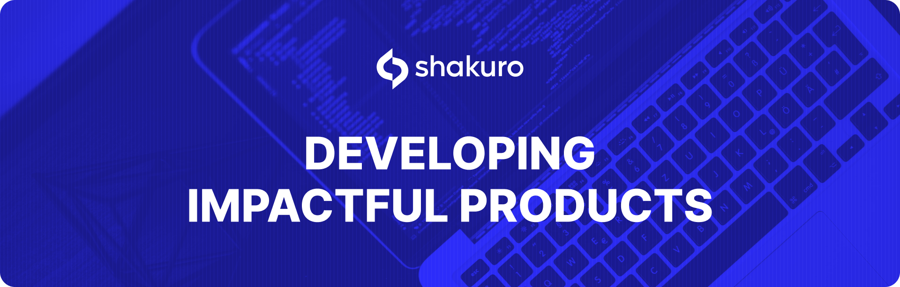
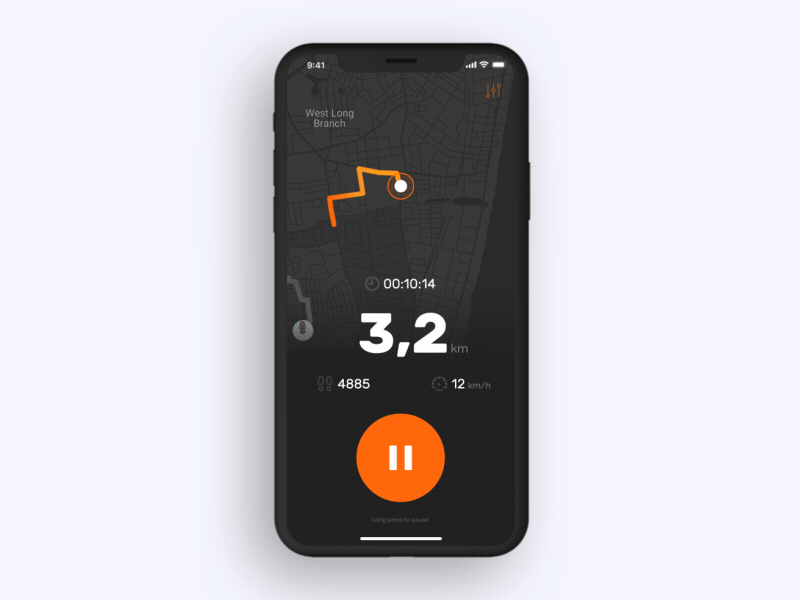
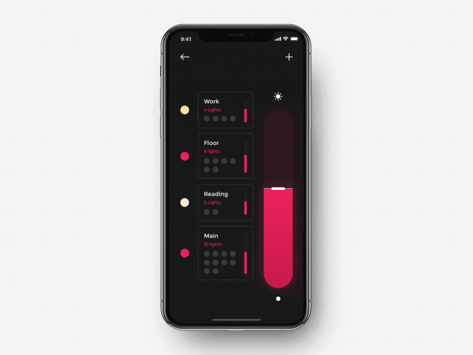
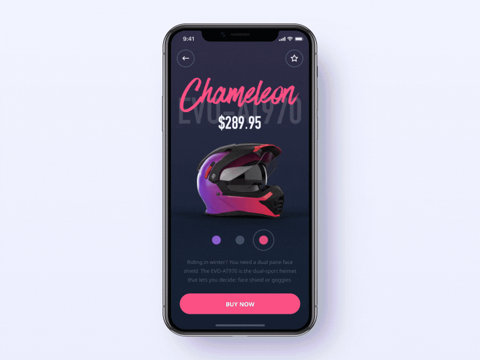
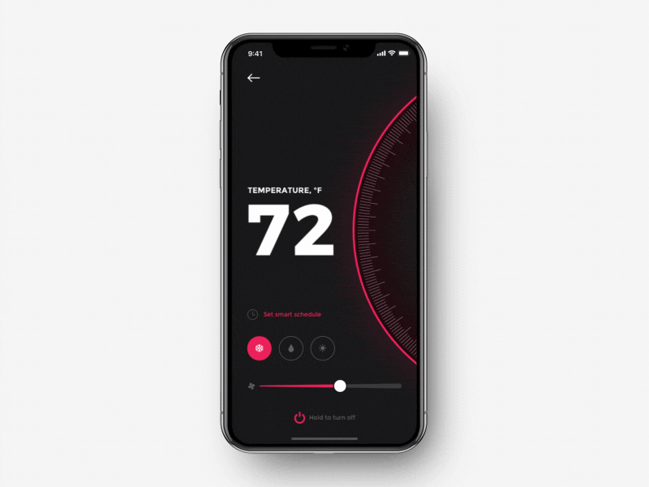

  
# Ready-Made-Swift-UI-Animation-Components

Want to create a demanded app but not sure how to build the interface? Check out these UI components suitable for various application types.

<h1 align="left"><a href="https://github.com/shakurocom/MovieListDemo">MovieList</a></h1>

<h1 align="left"><a href="https://github.com/shakurocom/MiFitDemo">MiFit</a></h1>

<h1 align="left"><a href="https://github.com/shakurocom/LightingDemo">Lighting</a></h1>

<h1 align="left"><a href="https://github.com/shakurocom/CinemaSeatsDemo">CinemaSeats</a></h1>

<h1 align="left"><a href="https://github.com/shakurocom/HelmetDemo">Helmet</a></h1>

<h1 align="left"><a href="https://github.com/shakurocom/ThermostatControl">ThermostatControl</a></h1>

<h1 align="left"><a href="https://github.com/shakurocom/humidistat">Humidistat</a></h1>

## License

Shakuro.PullToRefresh is released under the MIT license. [See LICENSE](https://github.com/shakurocom/Ready-Made-Swift-UI-Animation-Components/blob/master/LICENSE.md) for details.

## Give it a try and reach us

Star this tool if you like it, it will help us grow and add new useful things. 
Feel free to reach out and hire our team to develop a mobile or web project for you.

